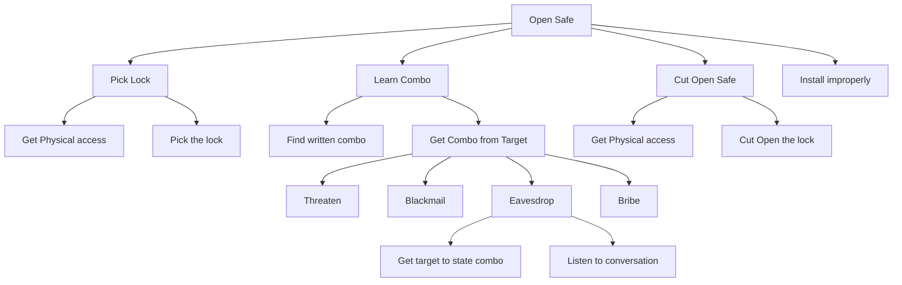

# Threat Modeling: Attack Graphs Technique

**[< Previous: Goals](../goals.md)**

Once you understand the potential attacker(s) and a goal, it is helpful to think through the ways in which they could achieve this.

hile you can just sit and do this in whatever way you want, it is often useful to reason about this by brainstorming using a tool called an Attack Graph. This is also called an Attack Tree, Threat Tree, or Threat Graph in some literature.

An attack tree has at the top (which is called the root node), the goal of the attacker.

For example, the attack tree below has “Open Safe” as the root node, so this is the attacker’s goal. The nodes in the tree (i.e., the square boxes) are connected by one or more edges (the lines between boxes). For two nodes that have an edge, the higher node is called the parent and the lower node is the child. The child node or nodes contain additional details about how to achieve the parent node.

In the next stage, we can see that the goal of learning the combination can be achieved in two ways - finding the written combination and getting the combination from the target (who is an authorized individual possessing the combination to the safe) which can further be done in 4 ways. These represent the OR nodes. Success in any one of these attacks leads to success of the ultimate goal of opening the lock. One attack to retrieve the combination from the target includes eavesdropping, which needs the success of two attacks where the victim states the combination and the attacker listening to the conversation. Failure of either results in an unsuccessful attempt to break the lock open.

> [!NOTE]
> **Unraveling Attack Graphs, Commentary by Justin Cappos**
>
> Attack graphs were really helpful for me when I was first starting to threat model large systems and also are really helpful now when I don’t understand a system well. Today, I often can intuitively go through and enumerate the cases here because I’ve had enough practice. So, I rarely write out an attack graph. (I usually jump straight to attack matrices, which will be described later.)
>
> You can think of the exercise of writing out an attack graph like writing out your multiplication tables by hand before you have them memorized. Eventually it may become second nature, but it will be an immense help at first. If you’re starting out, I strongly encourage you to start with attack trees though and get practice with them. This will help you build the foundation you need to do more accurate threat assessments.

One problem with attack graphs is you don’t necessarily know how complete they are. There are a wide array of things that you haven’t thought of. Be sure to think back to your system goals carefully and focus on them. When you reason about the situations where those goals hold, think about what those situations mean for an attacker. How is the attacker constrained? What can the attacker do? You may need to update the goals and other parts of the writeup as you go through this process.

There is a depth of material on attack trees that focuses on adding parameters of different types to them. They can do things like help you reason about what attackers with different skill sets / access / constraints might do in a system or how much an attack might cost an attacker. As you are working through examples, you may find it useful to refer to the following reference: Schneier, B. “Attack Trees.” Schneier on Security, Dr. Dobb's Journal, December 1999, https://www.schneier.com/academic/archives/1999/12/attack_trees.html.

> [!NOTE]
> Finding Business Value, Commentary from Jack Kelly
>
> For some clients or colleagues Attack Graphs and Trees are a valued deliverable. They are most valued by visual learners and non-technical persons as a tangible representation of what is elaborated on in a Threat Matrix. An Attack Graph helps a reader easily follow from initial breach to the attacker’s goal, and identify which nodes on the graph may be a hotspot either for traversal to other goals, or is used in many possible routes to the same point of impact. This provides a quantifiable justification for the controls used to remediate the threat of attack.
>
> Attack Graphs can be intensive to build out and maintain, so it is recommended to use a solution that can generate Attack Graphs from code.

**[> Next Up: DREAD Technique](./dread-technique.md)**
